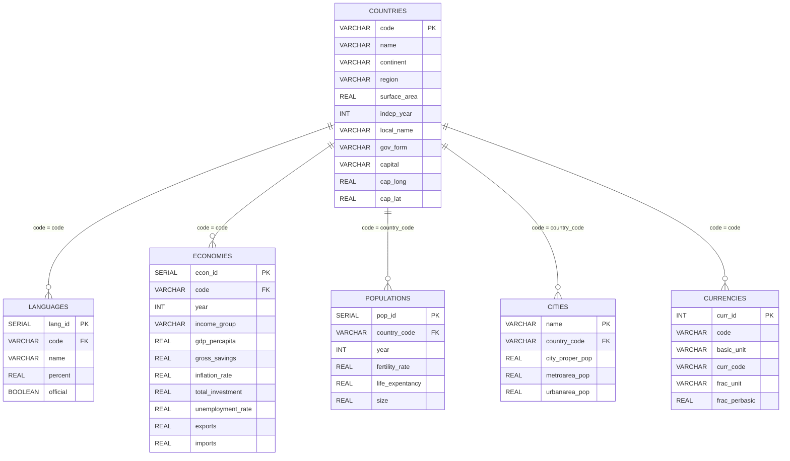

```mermaid
erDiagram
    COUNTRIES {
        VARCHAR code PK
        VARCHAR name
        VARCHAR continent
        VARCHAR region
        REAL surface_area
        INT indep_year
        VARCHAR local_name
        VARCHAR gov_form
        VARCHAR capital
        REAL cap_long
        REAL cap_lat
    }
    LANGUAGES {
        SERIAL lang_id PK
        VARCHAR code FK
        VARCHAR name
        REAL percent
        BOOLEAN official
    }
    ECONOMIES {
        SERIAL econ_id PK
        VARCHAR code FK
        INT year
        VARCHAR income_group
        REAL gdp_percapita
        REAL gross_savings
        REAL inflation_rate
        REAL total_investment
        REAL unemployment_rate
        REAL exports
        REAL imports
    }
    POPULATIONS {
        SERIAL pop_id PK
        VARCHAR country_code FK
        INT year
        REAL fertility_rate
        REAL life_expentancy
        REAL size
    }
    CITIES {
        VARCHAR name PK
        VARCHAR country_code FK
        REAL city_proper_pop
        REAL metroarea_pop
        REAL urbanarea_pop
    }
    CURRENCIES {
        INT curr_id PK
        VARCHAR code
        VARCHAR basic_unit
        VARCHAR curr_code
        VARCHAR frac_unit
        REAL frac_perbasic
    }

    COUNTRIES ||--o{ LANGUAGES : "code = code"
    COUNTRIES ||--o{ ECONOMIES : "code = code"
    COUNTRIES ||--o{ POPULATIONS : "code = country_code"
    COUNTRIES ||--o{ CITIES : "code = country_code"
    COUNTRIES ||--o{ CURRENCIES : "code = code"
```
