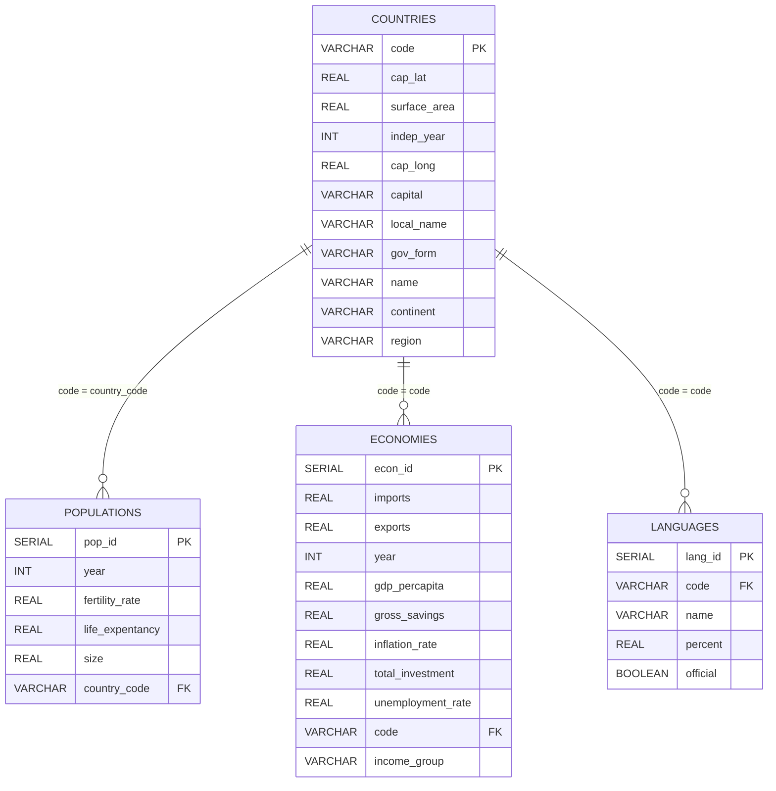

```mermaid
erDiagram
    COUNTRIES {
        VARCHAR code PK
        REAL cap_lat
        REAL surface_area
        INT indep_year
        REAL cap_long
        VARCHAR capital
        VARCHAR local_name
        VARCHAR gov_form
        VARCHAR name
        VARCHAR continent
        VARCHAR region
    }
    POPULATIONS {
        SERIAL pop_id PK
        INT year
        REAL fertility_rate
        REAL life_expentancy
        REAL size
        VARCHAR country_code FK
    }
    ECONOMIES {
        SERIAL econ_id PK
        REAL imports
        REAL exports
        INT year
        REAL gdp_percapita
        REAL gross_savings
        REAL inflation_rate
        REAL total_investment
        REAL unemployment_rate
        VARCHAR code FK
        VARCHAR income_group
    }
    LANGUAGES {
        SERIAL lang_id PK
        VARCHAR code FK
        VARCHAR name
        REAL percent
        BOOLEAN official
    }

    COUNTRIES ||--o{ POPULATIONS : "code = country_code"
    COUNTRIES ||--o{ ECONOMIES : "code = code"
    COUNTRIES ||--o{ LANGUAGES : "code = code"
```
